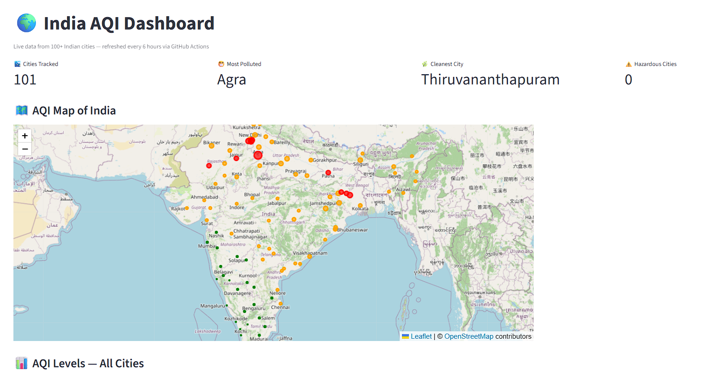

# India AQI Data Pipeline

---

I wanted to understand how air quality varies across India beyond just the major metros. So I built an end-to-end data pipeline that tracks AQI data from 101 Indian cities, stores it in MongoDB, and visualizes trends through interactive dashboards.

The system automatically collects, processes, and analyzes air quality data, making it easy to compare pollution levels across regions and identify patterns over time. Building this gave me hands-on experience with data engineering, cloud databases, pipeline automation, and visualization — all on real environmental data.

**[Live Streamlit Dashboard](https://environmental-data-pipeline-2dnkog5rys5suebnkpqyzv.streamlit.app)** · **[Live Dash Dashboard](https://environmental-data-pipeline.onrender.com)**

---

## What the data shows

- Delhi and Agra consistently rank as the most polluted cities across all runs
- Kochi, Coimbatore, and Thiruvananthapuram hold steady in the "Good" range
- City tiers classified from Census 2011 population data — 8 Metro, 32 Tier-1, 32 Tier-2, 29 Tier-3 cities across the dataset
- Tier-1 cities like Patna and Varanasi exceed safe AQI limits more often than southern metros
- A clear south-north divide — southern cities average 40% lower AQI than northern ones

| Region | Cities | Avg AQI | Category |
|--------|--------|---------|----------|
| North | Delhi, Agra, Patna | ~150 | Unhealthy |
| South | Kochi, Coimbatore, Chennai | ~35 | Good |

---

## How it works

Open-Meteo API → Python ETL → MongoDB Atlas (raw) → CSV → Streamlit + Dash

**Pipeline components:**
- fetch_aqi.py — pulls live AQI for 101 cities with rate limit handling: 3 retry attempts per city, 2-second exponential backoff between retries, 10-second request timeout, and automatic failed-city tracking with full logging
- clean_aqi.py — validates data and assigns air quality labels
- mongo_store.py — stores raw readings in MongoDB Atlas
- scheduler.py — automates the full pipeline every 6 hours
- alert.py — sends email alerts when cities hit dangerous AQI levels
- export_excel.py — Excel export for offline reporting

**PostgreSQL KPIs (src/transformation/kpi.py):**
- National average AQI across all 101 cities
- Category distribution — % of cities in Good / Moderate / Unhealthy / Hazardous
- Top 10 most polluted cities
- % of cities exceeding WHO safe limit (AQI > 100)
- City health score — normalised 0–100 inverse of AQI
- Pollution gap — worst vs best city (247 vs 30 = gap of 217)
- Hazardous city count (AQI > 200)
- AQI trend across historical pipeline runs

**Statistical analysis:**
- Descriptive stats — mean, median, std dev, skewness (2.56), kurtosis (6.99)
- Outlier detection via Z-score — Delhi and Agra flagged as statistical outliers
- AQI distribution by category across all 101 cities
- Hypothesis test — Mann-Whitney U test (non-parametric) comparing North vs South India AQI — p-value 0.009, statistically significant

**Data quality:** 4 automated checks on every pipeline run — null check, range check, duplicate check, freshness check

**Schema validation:** Pydantic models enforce field types and constraints on every AQI record before storage — city name, AQI range (0–500), and timestamp are all validated with structured error reporting

**Tests:** 9 pytest tests covering label boundaries and city data validation

**Dashboards:**
- Interactive India map with AQI bubbles for all 101 cities
- Bar chart, pie chart, scatter plot, and trend tracker
- Both Streamlit and Dash versions live

---

## Tech stack

Python · Pandas · PostgreSQL (Neon) · MongoDB Atlas · PyMongo · Streamlit · Dash · Plotly · Folium · Docker · GitHub Actions · Render
---

## Run locally

git clone https://github.com/saithrishadaggupati/environmental-data-pipeline.git
cd environmental-data-pipeline
pip install -r requirements.txt
cp .env.example .env
python -m src.ingestion.fetch_aqi
python -m src.loading.mongo_store
streamlit run dashboard/app.py

## Run with Docker

docker-compose up

## Run tests

pytest tests/ -v
